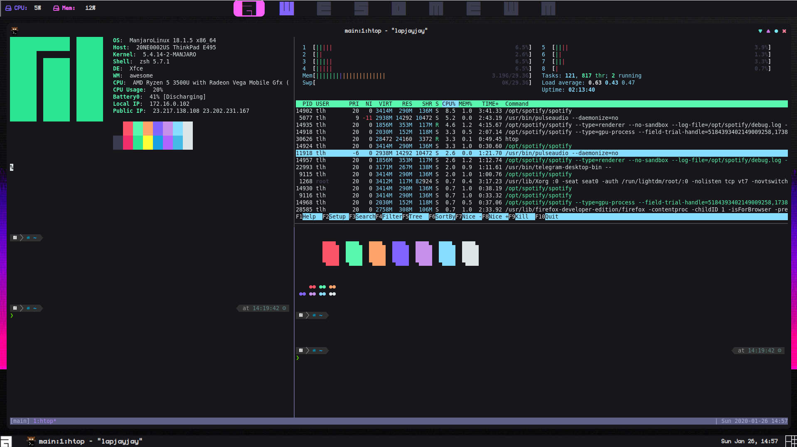
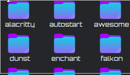

# Dotfiles

The configurations and set up I use on Linux

#### You Must Pull In the SubModules to Install These Dotfiles

```
git submodule update --init --recursive

# or

git clone --recursive
```

> Desktop Experience
> 

> tmux Experience



# Dotfiles of Thomas Leon Highbaugh

```
 ___     ___   ______  _____  ____  _        ___  _____
|   \   /   \ |      ||     ||    || |      /  _]/ ___/
|    \ |     ||      ||   __| |  | | |     /  [_(   \_
|  D  ||  O  ||_|  |_||  |_   |  | | |___ |    _]\__  |
|     ||     |  |  |  |   _]  |  | |     ||   [_ /  \ |
|     ||     |  |  |  |  |    |  | |     ||     |\    |
|_____| \___/   |__|  |__|   |____||_____||_____| \___|

```

> Never mind the bullocks, here's the dotfiles!'

Makefile managed configurations of ZSH, BASH, VIM, NeoVim, Kitty, Alacritty, AwesomeWM, SpaceMacs, Docker, Git, GTK, Ranger, Rofi+DMenu, Zathura, Xresources, Pacman, Firefox and More

> For Arch Linux with Yay installed prior to configuration ([yay's repo](https://github.com/Jguer/yay)



---

## Table of Contents

- [Purpose](#purpose)
- [Installation](#installation)
- [Features](#features)
- [FAQ](#faq)
- [License](#license)

---

## Purpose

This repo serves to host my dotfiles, or user configurations, as well as serves to provision a fresh installation of Arch until I figure out how to roll a custom installer that takes care of both provisioning and configuring my system all during installation.

The use of **Makefile** is what has enabled me to roll together the provisioning and configuring, as Makefile works essentially like a very handy shell script _in my use of it here_, which is hardly its only use and definitely not a full demonstration of its power.

## Installation

### Prerequisites

- First you will need to install Arch Linux, however you prefer (scripts, Anarchy ISO, Zen Installer, Manjaro's Installation methods, whatever's clever for you).

- Yay (follow instructions below)

```bash
git clone https://aur.archlinux.org/yay.git
cd yay
makepkg -si
```

**NOTE:** Some installers offer yay internally, this will also work!

### Provisioning With These Dotfiles

- **NOTE:** these are my personal configurations, according to my taste, which may or may not work for you. I reccomend adjusting to your needs and aesthetics before using them locally.

.png>)

---

## Features

### Configurations for

- ZSH: opinionated configuration utilizing zshrc, zshenv and zsh
- BASH: meant to function congruently with ZSH configuration
- SH: POSIX shell configurations to tie together BASH && ZSH configurations and apply consistent environmental variables across shells and terminals
- git - **change me to use or I will be credited for your commits**
- i3 - custom interface with rofi and polybar integration
- kitty - my terminal of choice (now without tmux, which gets in the way more often than not for my workflow)
- neofetch - for displaying system information
- vim && neovim - terminal text editing software with extensions that keep much as it is while adding useful functionality and a consistent colorscheme matching everything else
- polybar - system bars used with i3
- ranger - my new favorite file manager
- rofi - a menu display wrapper that is easily configured and can do wonder things, used in both Awesome and i3 contexts
- zathura - pdf && ebook reader with VIM keybinds (which sounds annoying but works well)
- Spacemacs - my favorite IDE/text editor for use outside of the terminal
- xorg - modifications, settings and a consistent colorscheme applied to the x11 window server.

### Misc. Directories

- ./bin/ - a folder with shell scripts and small applications utilized locally
  - Some of these are my scripts, some I have found around the internet (generally authors are acknowledged in the script, or links to where the idea came from is placed in a comment generally for my own reference. If you wrote a script and I seemed to have left your name out, let me know I am happy to add attribution)
- Includes the following scripts
  - `$` - if you paste a command from the internet proceeded by dollar sign, it takes off the dollar sign and runs the command
  - colorballs - using xresources colors to print balls
  - colorbars - prints bars with xresource colors
  - colorblocks - prints blocks with xresources colors
  - color-convert - hex codes to xterm-256
  - colorpanes - prints 'panes' or rectangles with a border, using xresources colors
  - colorrect - prints rectangles using xresources colors
  - colorscheme - prints out complete set of xresources colors on the other colors, providing a sense of what looks good (or bad) with what
  - colorshrooms (favorite) - prints out super mario style mushrooms with spots that are colored by xresources (looks better than ghosts or pipes)
  - colorsquares - prints out squares using xresources colors
  - fa-rofi - displays a list of fontawesome icons in rofi that you can select to copy it to the clipboard (available on i3 with Mod4 + Shift + F4)
  - git-hist-erase - erases github history by making a new branch and rebasing over the old. Good for oopsies moments when you commit secrets to your repos, or if you commit a bunch of data to your dotfiles then have to use slow internet even after removing the files from the repo as it is availabe in the history.
  - pacman-list - prints a list of installed packages to a text file in the directory it is run at (also see pacmanity)
  - prune-dirs - remove local directories without contents recursively
  - readme-template - generate a readme according to best practices (opinionated) for your project
  - scss-struct - generate an empty modular style sheet in scss
  - shell-struct - generates bash shell script scaffold, takes input of the script-to-be's name, adds info header, date, shebang, etc
  - urxvt-config - configures a urxvt terminal's settings
  - xvars - sets xvars based on xresources colors declared in .Xresources.d/colors
- ./lib/ - files and larger functionality that is nice to have across my workstation environments
  - ./install/ - installation scripts to provision the system called within each Makefile module
  - ./normalize-scss/ for structuring my stylesheets with the sass-struct script
  - ./README/ - for generating README templates

---

---

## License

[](http://badges.mit-license.org)

Copyright 2020 © <a href="http://thomasleonhighbaugh.me" target="_blank">Thomas Leon Highbaugh</a>.
