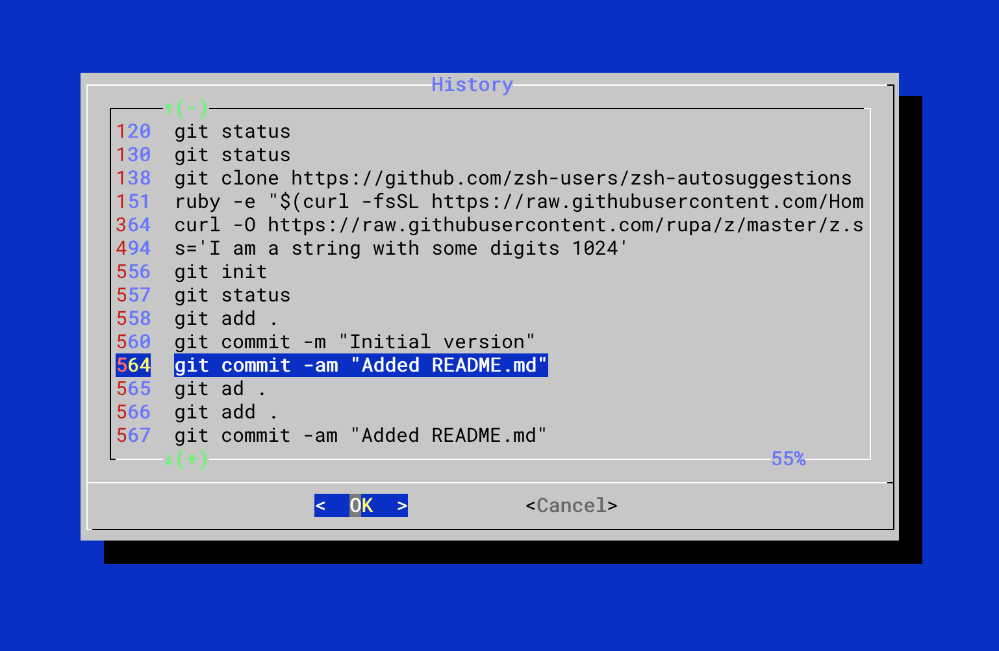

# Mistory
An oh-my-zsh plugin that captures the `PageUp` key and opens a popup menu with the history, so the user can interactively navigate through it and pick the history line to bring back to the prompt.

If the command line is empty when pressing `PageUp`, the popup displays all history, starting from the latest line and up to the beginning. If the command line contains some text, the popup uses that text to filter the history via the `grep` command, and display only the matching lines.

When the user selects a given history line, its text is placed in the command line, so it can be edited before hitting enter.

The following image is a screen capture of the popup filtering all history lines containing "git":


## Requirements
The popup is displayed via the `dialog` command, which is usually not installed, but is available from most distribution repositories as the package "dialog". You can check its [home page](https://invisible-island.net/dialog/#rel_packages) for more details.


## Installation

1. Create directory `mistory` inside `~/.oh-my-zsh/plugins`: and place `mistory.plugin.zsh` in it:
	```zsh
	mkdir ~/.oh-my-zsh/plugins/mistory
	cd ~/.oh-my-zsh/plugins/mistory
	curl -O https://raw.githubusercontent.com/lcrespom/oh-my-zsh-history-popup/master/mistory.plugin.zsh
	```

2. Add the plugin to the list of plugins in `~/.zshrc`:
	```zsh
	plugins=(
		# other plugins...
		mistory
	)
	```

3.  Re-open the zsh shell.
